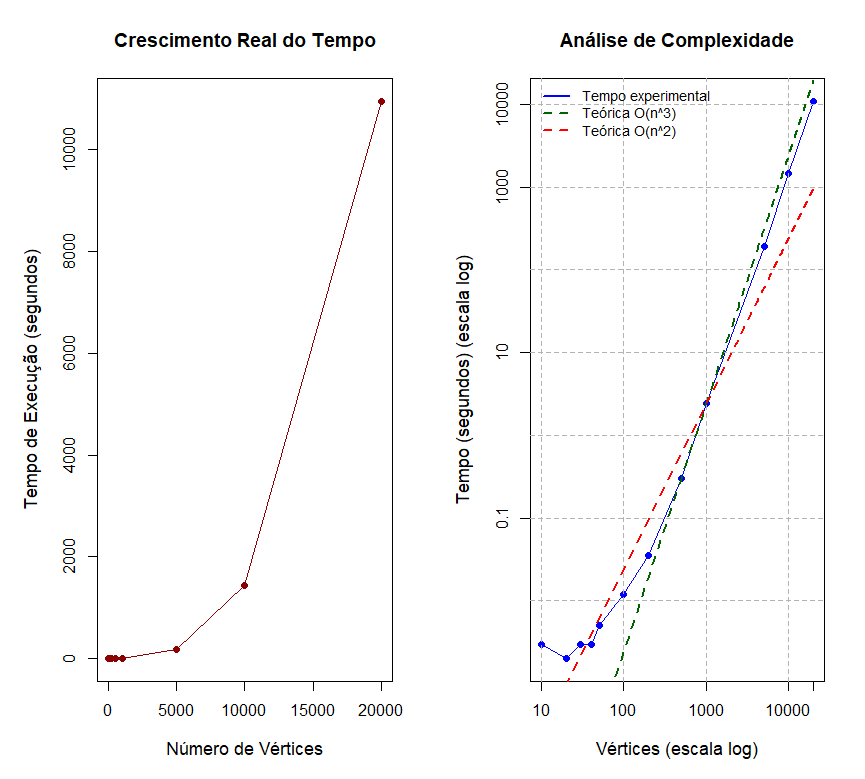

# Análise de Complexidade da Ordenação Topológica com Lista Encadeada

Este repositório documenta um projeto acadêmico da disciplina de **Estrutura de Dados**, focado na implementação de um algoritmo de **Ordenação Topológica** em Java. O diferencial do trabalho reside na construção de um grafo direcionado acíclico (DAG) por meio de uma **Lista Encadeada customizada** e em uma análise rigorosa da complexidade de tempo computacional.

**Autores:**
* Raul Candido de Sousa Rodrigues
* Rhuan Soares Ramos
* Thauan Fabrício da Rocha

**Instituição:** Universidade Federal do Estado do Rio de Janeiro (UNIRIO)

---

### 🎯 Sobre o Projeto

O objetivo central foi gerar grafos direcionados acíclicos (DAGs) e utilizar a ordenação topológica para produzir uma ordenação linear dos vértices que seja compatível com a ordem parcial inerente ao grafo. A partir disso, o projeto focou em verificar a complexidade do algoritmo de ordenação topológica e compará-la com a complexidade teórica esperada.

### ⛓️ Estrutura de Dados: Grafo como Lista Encadeada

Para um controle granular da alocação de memória e das operações, o grafo foi representado por uma **lista de adjacências**, onde tanto a lista de vértices quanto as listas de sucessores (adjacências) foram implementadas como listas encadeadas.

A estrutura é composta por duas classes internas principais:

1.  **`Elo` (Vértice):** Representa cada nó do grafo na lista encadeada principal.
    * `chave`: Identificador do vértice.
    * `contador`: Armazena o número de predecessores, essencial para o algoritmo.
    * `listaSuc`: Referência para a sub-lista de sucessores.
    * `prox`: Ponteiro para o próximo vértice na lista principal.

    ```java
    // Estrutura do nó principal (Vértice)
    private class Elo {
        public int chave;       // Identificador
        public int contador;    // Nº de predecessores
        public Elo prox;        // Próximo Elo na lista principal
        public EloSuc listaSuc; // Cabeça da lista de sucessores
    }
    ```

2.  **`EloSuc` (Aresta):** Representa a conexão de um vértice a um de seus sucessores, formando a lista de sucessores.
    * `id`: Referência para o `Elo` que é o sucessor.
    * `prox`: Ponteiro para o próximo sucessor na lista de adjacências.
    ```java
    // Estrutura do nó da lista de sucessores (Aresta)
    private class EloSuc {
        public Elo id;          // Referência para o nó sucessor
        public EloSuc prox;     // Próximo sucessor
    }
    ```

### ⚙️ Algoritmo e Análise de Complexidade

O processo de ordenação envolve a leitura dos dados, a manipulação da estrutura e a geração da saída ordenada. A complexidade de cada método principal foi analisada:

| Método          | Descrição                                                                                                                | Complexidade | Justificativa                                                                                                                 |
| :-------------- | :----------------------------------------------------------------------------------------------------------------------- | :----------- | :---------------------------------------------------------------------------------------------------------------------------- |
| `insereFinal`   | Adiciona um vértice no fim da lista principal.                                                               | $O(n)$       | Requer percorrer a lista até o último elemento para inserir.                                                      |
| `buscarElo`     | Procura por um vértice com uma chave específica.                                                             | $O(n)$       | No pior caso, percorre toda a lista de vértices.                                                                     |
| `realizaLeitura`| Lê as arestas de um arquivo. Para cada linha, invoca `buscarElo` e `insereFinal`.           | $O(n^{2})$   | O método lê cada linha do arquivo e executa operações $O(n)$, resultando em uma complexidade quadrática.    |
| `gerarSaida`    | Executa a ordenação topológica, percorrendo a lista de vértices sem predecessores e atualizando seus sucessores. | $O(n+m)$     | Possui um loop para os vértices ($n$) e um loop interno para as arestas ($m$). Esta é a complexidade clássica do algoritmo. |
| `executa`       | Orquestra a execução completa do algoritmo chamando os métodos principais.               | $O(n+m)$     | A complexidade é dominada pela etapa `gerarSaida`.                                                                |

*Nota: 'n' é o número de vértices e 'm' é o número de arestas.*

### 📊 Resultados e Análise de Performance

Testes foram executados com grafos de **10 a 20.000 vértices**, com cada teste repetido 10 vezes para obter uma média de tempo.



A análise visual dos gráficos revela o seguinte:

**Gráfico da Esquerda (Crescimento Real):**
Apresenta os dados em escala linear. A curva ascendente e acentuada confirma visualmente que o tempo de execução cresce de forma super-linear, o que é característico de uma complexidade polinomial.

**Gráfico da Direita (Análise em Escala Log-Log):**
Apresenta os dados em escala logarítmica, uma técnica essencial para analisar a ordem da complexidade. Este gráfico compara o desempenho experimental (linha azul) com as curvas teóricas de referência $O(n^3)$ e $O(n^2)$. A partir dele, observamos dois comportamentos distintos:

* **Para entradas < 500 vértices:** O comportamento é mais ruidoso e menos linear. A complexidade aparenta ser menor, aproximando-se da curva teórica de $O(n^2)$ devido à dominância de termos de ordem inferior.
* **Para entradas > 500 vértices:** O comportamento experimental mostra um expoente entre 2 e 3, indicando uma complexidade intermediária entre $O(n^2)$ e $O(n^3)$. Os dados permanecem consistentemente abaixo da previsão de $O(n^3)$, revelando que fatores de implementação amorteceram o crescimento cúbico teórico. Essa convergência é particularmente evidente para n = 1000, 5000, 10000 e 20000, onde os tempos seguem um expoente estimado de $O(n^{2.8})$.

Para encontrar o expoente de complexidade prática, foi aplicada a seguinte regressão linear:

```python
# Algoritmo em Python usado para a regressão
import numpy as np

n = np.array([500, 1000, 5000, 10000, 20000])
t = np.array([0.300, 2.404, 190.357, 1439.578, 10953.433])

# Coeficiente angular (k) da reta em escala log-log
k = np.polyfit(np.log10(n), np.log10(t), 1)[0]
# Resultado: k ≈ 2.814
```

Isso sugere que a complexidade prática do sistema implementado é de **$O(n^{2.8})$**.

### 🚀 Como Executar

1.  **Estrutura do Código:**
    * `GeradorGrafos.java`: Gera os arquivos de entrada com os grafos.
    * `OrdenacaoTopologica.java`: Contém toda a lógica da estrutura de dados e do algoritmo de ordenação.
    * `Main.java`: Ponto de entrada que executa os testes.

2.  **Execução:**
    * Compile as classes Java.
    * Execute a classe `Main`. O programa solicitará um número inteiro via console, que representa a quantidade de vértices do grafo a ser gerado e ordenado.
    * O programa irá:
        1.  Chamar `GeradorGrafos.gerarGrafo()` para criar um arquivo `[n].txt`.
        2.  Ler este arquivo com `ord.realizaLeitura()`.
        3.  Executar a ordenação e a análise de tempo com `ord.executa()`.
        4.  Imprimir o resultado e o tempo de execução no console e em um arquivo de log.

### 🏁 Conclusão

O estudo confirmou que o tempo de execução do algoritmo possui um **crescimento polinomial**, com a complexidade experimental $O(n^{2.8})$ se aproximando significativamente da complexidade teórica esperada. O modelo $O(n^{3})$ foi validado como um limite superior coerente para o sistema completo (incluindo leitura de arquivos). Os testes foram limitados a 20.000 vértices devido à capacidade de memória da máquina utilizada.

[Link para o relátorio completo](https://github.com/rhuanzero/OrdenacaoTopologica/blob/main/src/Trabalho%20Final%20de%20EDD-Ordena%C3%A7%C3%A3o%20Topol%C3%B3gica%20(Raul%2CRhuan%20e%20Thauan).pdf)


### 📚 Referências
* ESTEVES, Raul. Algoritmo de Fisher-Yates para embaralhamento de arrays. Medium, 2018.
* CARVALHO, Marco Antonio M. BCC204 - Teoria dos Grafos. UFOP, 2019.
* NUMPY. numpy.polyfit documentation. 2024.
